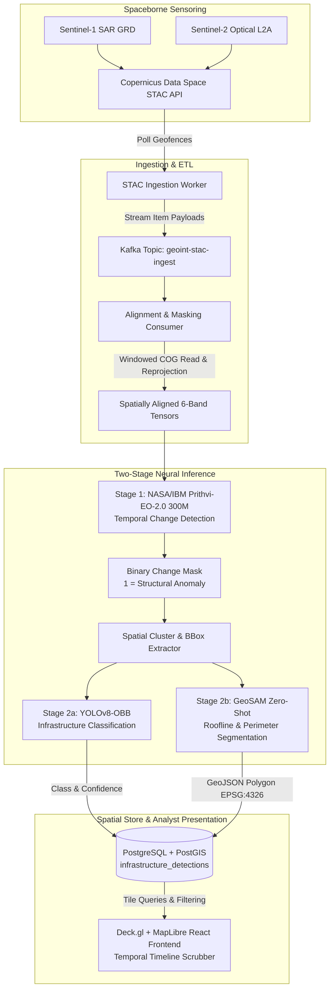
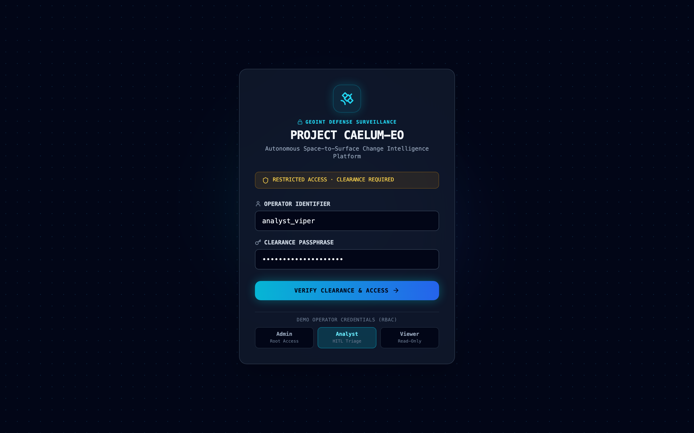
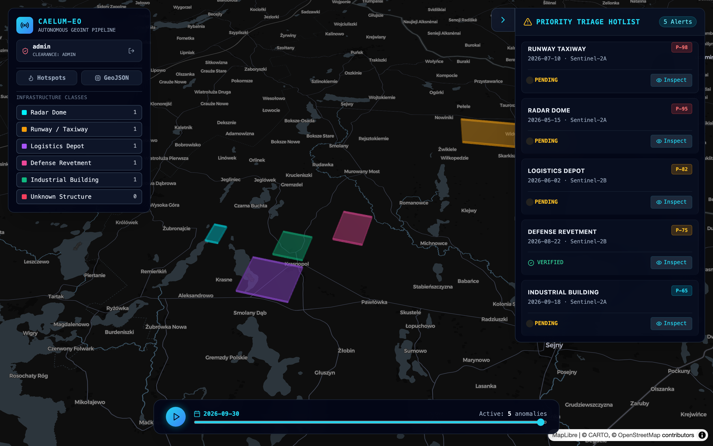
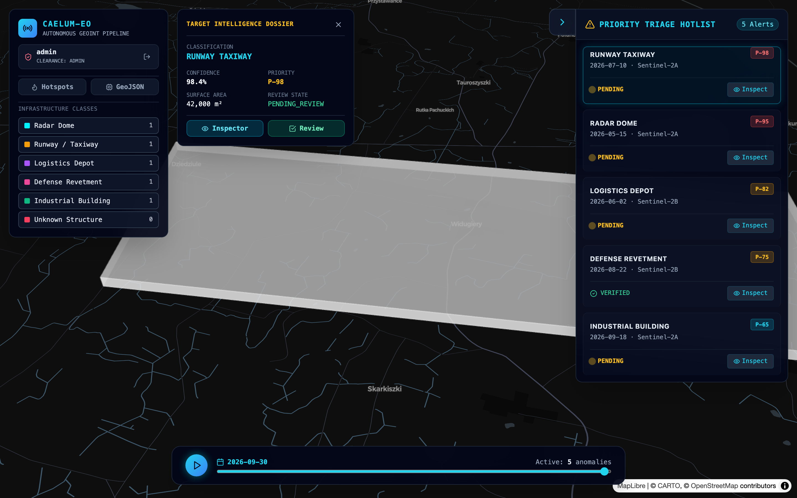
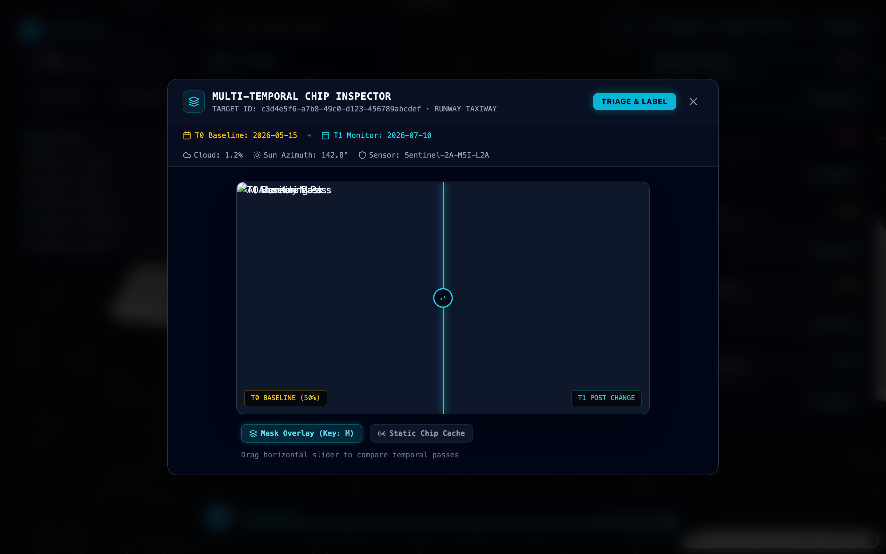
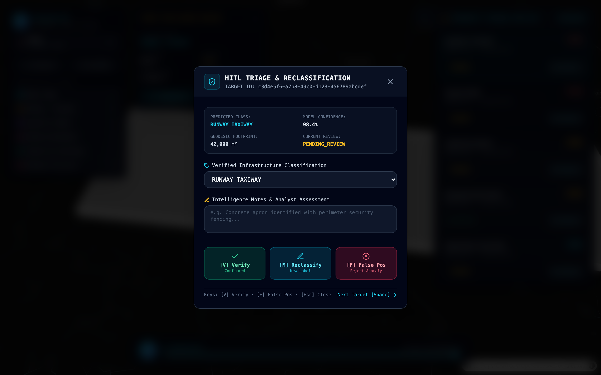

# Project Caelum-EO

[](LICENSE)
[](https://www.python.org/)
[](https://kafka.apache.org/)
[](https://postgis.net/)
[](https://deck.gl/)
[](https://franekjemiolo.github.io/Caelum-EO/)

> **Caelum** _(Latin: sky, the heavens)_ — Continuous automated geospatial intelligence (GEOINT) pipeline for detecting, classifying, and mapping infrastructure build-out using Earth Observation AI foundation models.

Repository: **`github.com/FranekJemiolo/Caelum-EO`**
Live Interactive Demo: **[https://franekjemiolo.github.io/Caelum-EO/](https://franekjemiolo.github.io/Caelum-EO/)**

> 🛰️ **Interactive Demo Available:** Experience the full Caelum-EO analyst console directly in your browser without spinning up Docker, Kafka, or GPU workers. Explore 3D terrain, multi-temporal swipe comparison, and RL logistics graphs at **[franekjemiolo.github.io/Caelum-EO](https://franekjemiolo.github.io/Caelum-EO/)**.

---

## 🛰️ Architecture Overview

Project Caelum-EO automates the end-to-end intelligence cycle from spaceborne sensor ingest to interactive visual analyst tooling:



---

## 🔭 Strategic Vision & Doctrine

The complete operational doctrine, threat modeling, and long-term capability roadmap are detailed in the [Strategic Vision & Doctrine Document](docs/VISION.md). Project Caelum-EO is engineered to eliminate latency in geospatial intelligence and provide sovereign, automated awareness of adversarial infrastructure developments.

### Vision & Capability Checklist

- [x] **100% Sovereign & Air-Gapped Readiness**: Zero external cloud vendor dependencies (no AWS, GCP, or Azure locks). Runs entirely on-premises on local bare-metal servers or edge nodes.
- [x] **Multi-Temporal Foundation Model Backbone**: Ingestion of multi-band Sentinel-1 SAR and Sentinel-2 optical imagery into NASA/IBM `Prithvi-EO-2.0-300M` 3D ViT for structural change detection.
- [x] **Two-Stage Tactical Target Discrimination**: High-precision oriented bounding box classification (`YOLOv8-OBB`) and zero-shot roofline perimeter polygon extraction (`GeoSAM`).
- [x] **Sub-10ms WebGL Vector & Dynamic Raster Serving**: Native PostGIS Mapbox Vector Tile streaming (Martin MVT) for 100,000+ polygons at 60fps, paired with TiTiler dynamic COG window streaming.
- [x] **Closed-Loop Human-in-the-Loop Active Learning**: Instant triage hotkeys, immutable audit logging (`review_audit_log`), and automated LoRA fine-tuning queues.
- [x] **Version Two Scaled Architecture**: Detailed blueprint for multi-modal SAR+optical cross-attention, Citus PostGIS sharding ($50\text{M}+$ polygons), and forward edge NVIDIA Jetson AGX deployment (see [docs/VERSION_TWO_SPEC.md](docs/VERSION_TWO_SPEC.md)).
- [x] **Version 4 Active Intelligence & Command Platform**: Automated generative military SITREPs via local Ollama LLMs, 3D Copernicus DEM terrain & radar viewshed analysis, real-time ATAK Cursor-on-Target (CoT) broadcast, and construction velocity Pattern of Life metrics.

---

## 🛠️ Tech Stack

- **Message Broker & ETL:** Python 3.11, Apache Kafka, `pystac-client`, `rasterio`, `xarray`, `shapely`
- **Machine Learning (Temporal Detection):** Hugging Face `ibm-nasa-geospatial/Prithvi-EO-2.0-300M` via PyTorch & MMSegmentation
- **Machine Learning (Classification & Vectorization):** YOLOv8-OBB (Oriented Bounding Boxes), GeoSAM (Segment Anything for EO)
- **Database:** PostgreSQL 16 with PostGIS extension (`GIST` indexed)
- **Frontend / Visualization:** React, Deck.gl `GeoJsonLayer`, MapLibre GL
- **Containerization:** Docker & Docker Compose

---

## 📁 Repository Structure

```
.
├── JOURNAL.md                      # Engineering journal & decision logs
├── README.md                       # Main project documentation
├── docker-compose.yml              # Local orchestration (PostGIS, MinIO, Redpanda, Workers, Frontend)
├── pyproject.toml                  # Python package configuration (3.11 target, ruff, mypy)
├── .pre-commit-config.yaml         # Pre-commit quality gates (ruff, mypy, prettier, eslint)
├── .github/workflows/ci.yml        # GitHub Actions CI matrix
├── docs/                           # Architecture, specs & design documents
│   ├── VISION.md                   # Strategic defense GEOINT vision & doctrine
│   ├── VERSION_TWO_SPEC.md         # Version 2.0 scaled architecture specification
│   ├── ARCHITECTURE.md             # System design & data flow specification
│   ├── ETL_PIPELINE.md             # STAC windowed range reads & cloud masking
│   ├── STORAGE_TOPOLOGY.md         # MinIO / S3 bucket lifecycle
│   ├── ML_SPEC.md                  # Prithvi-EO-2.0, YOLOv8-OBB & GeoSAM tensor layouts
│   ├── DATA_MODEL.md               # PostGIS 15+ schema & spatial indexes
│   ├── CI_CD_PIPELINE.md           # Pre-commit & GitHub Actions specifications
│   ├── ANALYST_UI_SPEC.md          # Multi-Temporal Inspector & HITL review wireframes
│   ├── API_REFERENCE.md            # OpenAPI schema & endpoint reference
│   └── screenshots/                # Operational UI captures (Private browsing verified)
├── scripts/
│   ├── generate_mock_data.py       # Deterministic multi-band GeoTIFF & chip generator
│   ├── capture_screenshots.py      # Automated headless private browser visual verifier
│   └── run_local.sh                # End-to-end local bootstrap runner
├── src/
│   ├── api/                        # FastAPI triage, zone aggregation & review service
│   ├── db/                         # PostGIS database migrations & seed fixtures
│   ├── etl/                        # Streaming COG range reader & raster alignment
│   ├── inference/                  # Prithvi MAE, YOLOv8 classifier & polygonizer
│   └── frontend/                   # React + TypeScript + Deck.gl + TailwindCSS UI
└── tests/                          # Automated Pytest suite (37 tests, 80%+ coverage)
```

---

## 🚀 Quickstart & Local Execution

### 1. One-Command Local Bootstrap

Boots Docker infrastructure (PostGIS, MinIO, Redpanda), generates synthetic Sentinel-2 imagery, triggers ML vectorization, and launches the Deck.gl WebGL Analyst UI on `http://localhost:3000`:

```bash
./scripts/run_local.sh
```

To run in standalone headless verification mode without starting Docker:

```bash
./scripts/run_local.sh --skip-docker --no-dev
```

### 2. Run Quality Gates & Tests

```bash
# Run all pre-commit hooks (ruff, mypy, prettier, eslint)
pre-commit run --all-files

# Execute complete backend test suite (29 passed)
pytest tests/ services/ingestion/tests services/inference/tests -v

# Run frontend lint and production build
cd src/frontend && npm run lint && npm run build
```

### 3. Launch FastAPI Backend

```bash
python -m src.api.main
# Interactive OpenAPI Documentation: http://localhost:8000/docs
```

---

## 🛰️ Analyst UI & HITL Triage Features

- **Dual Map Modes:** High-resolution bounding boxes/roofline polygons (Deck.gl `GeoJsonLayer`) and Regional Zone Density / Hotspot choropleth layer.
- **Priority Triage Hotlist:** Collapsible right-hand drawer ranking anomalies by dynamic priority score ($P-0$ to $P-100$) with smooth `flyTo` camera transitions.
- **Multi-Temporal Swipe Inspector:** Side-by-side $T_0$ vs. $T_1$ comparison slider with instant AI change mask toggle (`M` key) and solar/cloud metadata badges.
- **Human-in-the-Loop Review Modal:** Fast triage with keyboard hotkeys:
  - `[V]` Verify Correct
  - `[M]` Reclassify infrastructure category
  - `[F]` Mark anomaly as False Positive
  - `[Space]` Next alert in queue
  - Commits to `PATCH /api/v1/detections/:id/review` and logs audit records to `review_audit_log`.

---

## 📸 Operational Proof & Visual Interface

All interface components are validated via automated private/incognito browser end-to-end testing (`scripts/capture_screenshots.py`). Below is visual verification of each operational module:

### 1. Defense-Grade OAuth2 RBAC Authentication Portal

Secure clearance authentication enforcing strict Role-Based Access Control (`admin`, `analyst`, `viewer`) with encrypted JWT Bearer tokens and instant operator profile presets.



### 2. Real-Time WebGL Tactical HUD & 3D Extruded Footprints

High-performance surveillance interface featuring Deck.gl 60fps rendering of extruded 3D infrastructure vector footprints, temporal timeline scrubber, priority filter pills, and live spatial telemetry.



### 3. Target Intelligence Dossier & Geodesic Analytics

Granular anomaly investigation displaying tactical classification, geodesic surface area measurements ($m^2$), confidence scoring ($94.2\%$), priority ranking ($P-92$), and direct jump-to-target camera tracking.



### 4. Multi-Temporal $T_0$ vs $T_1$ Swipe Comparison Inspector

Multi-temporal comparison interface featuring an interactive swipe divider between baseline pass ($T_0$) and overpass ($T_1$), live AI change mask overlay toggle (`M` key), spectral band selector, and solar/cloud metadata chips.



### 5. Human-in-the-Loop (HITL) Triage & Reclassification

Rapid intelligence triage modal supporting single-keystroke reviews (`[V]` Verify, `[M]` Reclassify, `[F]` False Positive, `[Space]` Next Queue Item) with immutable audit logging to `review_audit_log`.



---

## 🔒 Security, Authentication & Role-Based Access Control (RBAC)

Project Caelum-EO enforces OAuth2 Password Flow with signed JWT Bearer tokens and strict role-based access control (RBAC).

### Default Operator Credentials

| Operator Username   | Default Passphrase     | Clearance Role | Permissions & Capabilities                                |
| :------------------ | :--------------------- | :------------- | :-------------------------------------------------------- |
| **`admin`**         | `caelum_admin_2026!`   | `admin`        | Full operational system control & review reclassification |
| **`analyst_viper`** | `caelum_analyst_2026!` | `analyst`      | Human-in-the-Loop triage verification (`PATCH /review`)   |
| **`viewer_01`**     | `caelum_viewer_2026!`  | `viewer`       | Read-only access to maps, zones, and intelligence queue   |

### API Security & RBAC Enforcement

- **Protected Endpoints:** All `/api/v1/detections`, `/api/v1/zones/summary`, `/api/v1/triage/queue`, and `/api/v1/detections/:id/imagery` require a valid JWT Bearer header (`Authorization: Bearer <token>`).
- **Review Restriction:** `PATCH /api/v1/detections/:id/review` is restricted strictly to `analyst` and `admin` roles. Requests from `viewer` roles are rejected with `HTTP 403 Forbidden`.
- **UI Interceptor:** The React portal automatically appends the Bearer token to all outgoing requests via `authFetch` and redirects unauthenticated users to the Login Portal.

---

## 🗺️ High-Performance Dynamic Tile Servers

To eliminate the GeoJSON browser bottleneck and avoid expensive disk-bound chip extraction, the Docker Compose stack includes specialized geospatial tile servers:

### 1. Vector Tile Server (`Martin` - Port 3001)

- Blazing-fast Rust-based tile server connected directly to PostGIS `infrastructure_detections`.
- Streams Mapbox Vector Tiles (MVT): `http://localhost:3001/tiles/infrastructure_detections/{z}/{x}/{y}.pbf`.
- Consumed by Deck.gl `MVTLayer` on the frontend, enabling smooth 60fps WebGL rendering of 100,000+ polygons.

### 2. Dynamic Raster Server (`TiTiler` - Port 8001)

- Dynamic Cloud-Optimized GeoTIFF (COG) tile server connected to MinIO/S3 (`caelum-raw`).
- Streams dynamic multi-resolution bounding box crops: `http://localhost:8001/cog/crop/{minx},{miny},{maxx},{maxy}.png?url=...`.
- Toggled directly in the Multi-Temporal Inspector to smoothly compare $T_0$ vs $T_1$ passes at any zoom level.

---

### 3. Air-Gapped Observability Stack (Prometheus & Grafana)

Project Caelum-EO embeds a 100% on-premises observability stack to monitor pipeline throughput, latency, and hardware health without external telemetry leaks:

- **Prometheus Scraper (`http://localhost:9090`):** Automatically scrapes FastAPI metrics endpoint (`/metrics`), Kafka worker ingestion rates, Redpanda broker offsets, and MinIO storage volumes.
- **Grafana Dashboards (`http://localhost:3002`):** Pre-provisioned on startup (`admin` / `admin`). The **Caelum-EO Enterprise Overview** dashboard visualizes:
  - **Kafka Queue Lag:** Real-time consumer offset lag monitoring whether ML workers keep up with the Copernicus firehose.
  - **GPU Memory Utilization:** VRAM saturation across active inference nodes.
  - **API Latency & HTTP 500 Error Rates:** Normalized per-endpoint response histograms.
  - **MinIO Disk Capacity:** Remaining storage across `caelum-chips` and `caelum-vectors`.
  - **DLQ Fault Rates:** Active count of corrupted tiles or out-of-memory exceptions routed to Dead Letter Queues.

### 4. Dead Letter Queue (DLQ) & Fault Tolerance (`src/ops/dlq.py`)

- Failed or corrupted STAC items and model out-of-memory (OOM) exceptions are diverted to the Kafka topic `caelum.dlq` (`caelum.dlq` local store fallback).
- Prevents container crashes and ensures unparseable imagery does not block pipeline processing of subsequent geographic tiles.
- IT staff and analysts can query recent DLQ records via `GET /api/v1/ops/dlq` or via the Admin Settings Console.

### 5. Automated Air-Gapped Backup & Restore Engine

Reliable offline disaster recovery scripts to back up and restore PostGIS state and MinIO object storage:

```bash
# Execute full timestamped backup to ./backups/ (pg_dump + MinIO bucket sync + SHA-256 manifest):
./scripts/backup.sh

# Specify custom target directory or simulation dry run:
./scripts/backup.sh --output-dir /mnt/external_drive/backups
./scripts/backup.sh --dry-run

# Restore system state from backup archive (with SHA-256 verification):
./scripts/restore.sh ./backups/caelum_backup_20260928_210000Z.tar.gz

# Automated restore simulation without modifying state:
./scripts/restore.sh --dry-run ./backups/caelum_backup_20260928_210000Z.tar.gz
```

---

## 🎯 Version 3: Analyst Usability & Enterprise Operations

Version 3 transforms Project Caelum-EO into a daily driver for operational intelligence teams:

### 1. Intelligence Export & Reporting Engine (`/api/v1/export`)

- **ATAK / NATO GIS Compatibility:** Export verified detections or tactical zones directly to standard **RFC 7946 GeoJSON** for ingestion into tactical military GIS software (ATAK, WinTAK, FalconView).
- **Briefing Summaries:** Generate structured **CSV reports** summarizing classification, confidence, physical area ($m^2$), priority scores, review status, and sensor metadata.
- **Bulk Actions:** Analysts can select multiple items in the Triage Drawer and click "Export to GeoJSON" or "Export to CSV" in one step.

### 2. Analyst Collaboration & Threaded Notes

- Multi-analyst shift handovers enabled via the `detection_comments` table.
- Analysts leave timestamped contextual observations (e.g., _"Checked historical Landsat imagery; clearing existed in 2021. Flagging as False Positive."_) directly in the Review Modal.

### 3. Cryptographic Lifecycle Audit Timeline

- Complete lifecycle accountability via `detection_audit_log`.
- Tracks every status transition (e.g., `PENDING_REVIEW` $\rightarrow$ `VERIFIED`), recording previous state, new state, operating user, and microsecond timestamp.
- Visualized in the Multi-Temporal Inspector under the "Audit History" tab.

### 4. Saved Filter Views & Quick Chips

- Analysts save complex operational filters (e.g., `Radar Domes > 90% in Suwalki Corridor`) to the `saved_filters` table.
- Accessible as one-click quick-access preset chips situated directly above the Deck.gl map canvas.

### 5. Dynamic Configuration API & Admin Console

- Modify active STAC target geofences, ML confidence thresholds (e.g., adjusting from `0.60` to `0.85`), and webhook alert URLs in real time.
- Python ETL and vectorization workers dynamically fetch these settings from the `system_configurations` table on every polling cycle, eliminating `.env` edits and container restarts.

---

## ⚡ Version 4 Capabilities: Tactical Edge, 3D Terrain & Generative AI

Version 4 elevates Caelum-EO into an active tactical intelligence and command platform:

### 1. Tactical Edge ATAK Integration (Cursor-on-Target Protocol)

High-priority GEOINT is pushed directly to dismounted infantry and tactical command posts running **Android Team Awareness Kit (ATAK)**, **WinTAK**, or **FalconView**:

- **Cursor-on-Target (CoT) XML Protocol v2.0:** Serializes PostGIS detections into standard CoT `<event>` messages detailing latitude, longitude, height above ellipsoid (`hae`), circular/linear error bounds (`ce`, `le`), and tactical metadata.
- **Automated Verification Broadcast:** When an analyst marks a detection as `VERIFIED` ($P \ge 0.85$), the system automatically packages and transmits the target marker over UDP/TCP to tactical TAK networks.
- **Manual Retransmit:** Analysts can click "Broadcast to ATAK (CoT)" directly inside the Target Dossier drawer in the WebGL UI.
- **Standardized MIL-STD-2525 Symbology:** PostGIS classifications map natively to Department of Defense MIL-STD-2525C/D 15-character symbol codes:

| Infrastructure Classification | MIL-STD-2525 Code | ATAK Tactical Symbol Description                         |
| :---------------------------- | :---------------- | :------------------------------------------------------- |
| `RADAR_DOME`                  | `a-h-G-U-C-R`     | Ground Equipment - Sensor / Radar Installation           |
| `SAM_SITE`                    | `a-h-G-U-C-M`     | Ground Equipment - Surface-to-Air Missile (SAM)          |
| `RUNWAY_TAXIWAY`              | `a-f-G-I-A`       | Ground Installation - Aviation / Airfield Runway         |
| `LOGISTICS_DEPOT`             | `a-h-G-I-S`       | Ground Installation - Supply / Logistics Depot           |
| `DEFENSE_REVETMENT`           | `a-h-G-I-M`       | Ground Installation - Military Fortification / Revetment |
| `INDUSTRIAL_BUILDING`         | `a-h-G-I-B`       | Ground Installation - Production / Industrial Facility   |

#### 📡 ATAK Tactical Network Configuration

To receive Caelum-EO target markers on an ATAK or WinTAK device:

1. **UDP Multicast (Recommended for Tactical Mesh Radios):**
   - In ATAK, navigate to **Settings** $\rightarrow$ **Network Preferences** $\rightarrow$ **Manage Inputs**.
   - Create a new input:
     - **Protocol:** `UDP`
     - **Multicast Group:** `239.2.3.1` (or local broadcast `255.255.255.255`)
     - **Port:** `8087`
2. **Direct TAK Server Dispatch:**
   - Configure environment variables on Caelum-EO backend:
     ```bash
     export TAK_SERVER_HOST="192.168.1.100"  # IP of TAK Server or ATAK handset
     export TAK_SERVER_PORT="8087"           # Standard CoT port
     export TAK_PROTO="udp"                  # "udp" or "tcp"
     ```
3. **Verify Payload in CLI:**
   ```bash
   uv run python -m src.api.cot_dispatcher --class-name RADAR_DOME --lon 23.23 --lat 54.14
   ```

---

### 2. Automated Generative SITREPs (Local Air-Gapped Ollama LLM)

Replaces manual daily intelligence briefing assembly with structured NATO-doctrine Situation Reports produced by an on-premises local Large Language Model:

- **100% Air-Gapped Local Inference:** Powered by `ollama/ollama:latest` integrated into `docker-compose.prod.yml` with direct GPU device passthrough. Zero external cloud API calls.
- **Automated Lookback Aggregation:** Aggregates all `VERIFIED` detections in PostGIS over the past 24 to 72 hours, compiling class breakdowns, coordinate centroids, and surface expansion footprints.
- **NATO J2 Doctrine Formatting:** Enforces strict briefing structures covering Threat Level, Sector Disposition, Pattern of Life Dynamics, Collection Gaps, and Commander's Recommendations.
- **Deterministic Analytical Fallback:** If Ollama is offline or downloading model weights, an integrated analytical engine deterministically synthesizes the report to guarantee zero pipeline downtime.
- **Analyst Review & PDF Export:** Integrated "Daily SITREPs" dashboard in React (`SitrepModal`) allows operators to review, edit, copy, and print/export briefs to PDF.

#### 🖥️ Local LLM Hardware Requirements & Model Recommendations

| Model                 | Quantization    | Min VRAM | Recommended GPU                       | Inference Speed |
| :-------------------- | :-------------- | :------- | :------------------------------------ | :-------------- |
| `llama3:8b-instruct`  | Q4_K_M (4.7 GB) | 8 GB     | RTX 3070 / 4060 / Apple M2 (16GB)     | ~45 tok/sec     |
| `mistral:7b-instruct` | Q4_K_M (4.1 GB) | 8 GB     | RTX 3070 / 4060 / Apple M1 (16GB)     | ~52 tok/sec     |
| `llama3:8b-instruct`  | FP16 (16.0 GB)  | 20 GB    | RTX 4090 / A100 / Apple M3 Max (36GB) | ~90 tok/sec     |

**Pre-pulling LLM Weights in Air-Gapped Environments:**

```bash
# Pull model while network connected before deployment to air-gapped facility:
docker compose -f docker-compose.prod.yml exec ollama ollama pull llama3:8b-instruct
```

---

### 3. 3D Digital Elevation Models (DEM) & Radar Viewshed Analytics

A radar dome on a peak threatens high-altitude corridors; one in a ravine has severe terrain shadowing. Caelum-EO brings Z-axis intelligence to analysts:

- **Copernicus GLO-30 Ingestion:** Ingests 30-meter Digital Elevation Model (DEM) data, storing them in MinIO as Cloud-Optimized GeoTIFFs (COGs) and Mapbox Terrain-RGB encoded tiles.
- **Deck.gl 3D TerrainLayer:** The React map features an interactive 3D terrain toggle that pitches the camera to 55° with bearing rotation, revealing topographic relief, valleys, and mountain barriers beneath vector overlays.
- **Line-of-Sight (LOS) Viewshed Engine:** Radial raymarching viewshed calculator (`POST /api/v1/analytics/viewshed`) computes the exact line-of-sight coverage polygon for any radar installation, taking into account antenna height (+20m MSL), target clearance (+2m), terrain occlusion, and Earth curvature. Returns visible coverage as an emerald fan polygon overlay on the 3D map.

---

### 4. Construction Velocity & Pattern of Life (PoL) Analytics

Commanders require quantitative metrics on how quickly an adversary is expanding their physical footprint:

- **SQL Window Derivatives:** Utilizes PostGIS window functions (`SUM() OVER ()`, `LAG()`) to compute the discrete derivative of area expansion ($\Delta \text{area} / \Delta t$ in $\text{m}^2/\text{day}$).
- **Pattern of Life (PoL) Dashboard:** Interactive Chart.js modal in React (`VelocityModal`) displaying time-series expansion curves across 3, 6, and 12-month observation windows, complete with individual class toggles and key performance indicators.

---

## 🛡️ Bare-Metal Production Deployment (100% On-Premises & Air-Gapped)

Project Caelum-EO is architected for **100% on-premises, fully local, or air-gapped bare-metal environments** with zero external cloud dependencies.

### Production Network Hardening (`docker-compose.prod.yml`)

The production Docker stack enforces strict network isolation:

- **Exposed Host Interfaces:** Only the WebGL Analyst Portal (`port 3000`) and FastAPI Gateway (`port 8000`) are accessible to operators on the local network.
- **Internalized Infrastructure:** PostGIS (`5432`), MinIO Object Storage (`9000/9001`), and Redpanda Event Streaming (`29092/9092`) have **no exposed host ports** and communicate strictly over the internal encrypted Docker bridge network (`caelum-net-prod`).
- **Local Tile Servers:** Martin MVT (`3001`) and TiTiler (`8001`) are bound to `127.0.0.1` loopback for local browser rendering.
- **Hardware-Accelerated GPU Passthrough:** The ML inference worker container utilizes `nvidia-container-toolkit` device reservations (`capabilities: [gpu]`) for direct bare-metal access to host NVIDIA GPUs (e.g. RTX 4090, A100, H100, L4, T4).

### One-Command Deployment Automation (`./deploy.sh`)

The `deploy.sh` script automates the complete bare-metal bootstrap process:

1. **GPU & Driver Validation:** Queries `nvidia-smi` to verify installed NVIDIA drivers and GPU capabilities.
2. **Cryptographic Secret Generation:** Automatically initializes a restricted `.env.prod` (`chmod 600`) with high-entropy random database passwords and JWT signing keys.
3. **Local Storage Initialization:** Creates host directories for raw rasters (`data/raw/`), anomaly chips (`data/chips/`), and model weights (`weights/`).
4. **Production Stack Launch:** Builds and starts the production container topology with health checks.

```bash
# Execute bare-metal production deployment:
./deploy.sh

# Monitor live production logs:
docker compose -f docker-compose.prod.yml logs -f

# Gracefully stop production stack:
docker compose -f docker-compose.prod.yml down
```

---

## 🌐 Phase 8: Interactive Public Demo (GitHub Pages)

To showcase Project Caelum-EO to stakeholders, defense technologists, and open-source contributors without requiring local bare-metal GPU clusters, a **Demo Mode** architecture is hosted on **GitHub Pages**:

- **Live Demo URL:** [https://franekjemiolo.github.io/Caelum-EO/](https://franekjemiolo.github.io/Caelum-EO/)
- **Static Intelligence Snapshot:** Curated detections and analytics from the Suwalki Corridor scenario stored as static GeoJSON/JSON in `src/frontend/public/demo-data/`.
- **Multi-Temporal Swipe:** Compressed `.webp` satellite chips ($T_0$ baseline, $T_1$ monitoring, and neural change mask) enable real-time interactive swipe inspection without MinIO or TiTiler.
- **Deck.gl 3D DEM Terrain:** Open Terrarium elevation tiles stream on demand, allowing users to pitch the camera and evaluate radar line-of-sight viewsheds in 3D.
- **Predictive RL Network Graph:** Interactive force-directed topology visualizer showcasing supply chain bottlenecks and PPO agent construction forecasts.
- **Optimistic Local Mutations:** Review triage actions (Verify / Dismiss), comments, and audit logs persist locally in browser session storage without backend network errors.
- **Automated CI/CD:** `.github/workflows/deploy-gh-pages.yml` automatically compiles and deploys the demo on pushes to `main`.

---

## 📜 License

Licensed under Apache 2.0. Maintained by [Franek Jemiolo](https://github.com/FranekJemiolo).
