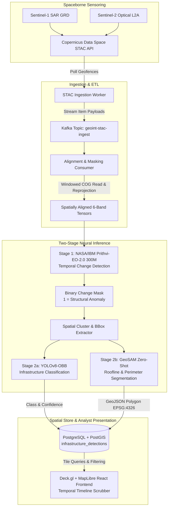

# Project Caelum-EO

[](LICENSE)
[](https://www.python.org/)
[](https://kafka.apache.org/)
[](https://postgis.net/)
[](https://deck.gl/)

> **Caelum** _(Latin: sky, the heavens)_ — Continuous automated geospatial intelligence (GEOINT) pipeline for detecting, classifying, and mapping infrastructure build-out using Earth Observation AI foundation models.

Repository: **`github.com/FranekJemiolo/Caelum-EO`**

---

## 🛰️ Architecture Overview

Project Caelum-EO automates the end-to-end intelligence cycle from spaceborne sensor ingest to interactive visual analyst tooling:



---

## 🛠️ Tech Stack

- **Message Broker & ETL:** Python 3.11, Apache Kafka, `pystac-client`, `rasterio`, `xarray`, `shapely`
- **Machine Learning (Temporal Detection):** Hugging Face `ibm-nasa-geospatial/Prithvi-EO-2.0-300M` via PyTorch & MMSegmentation
- **Machine Learning (Classification & Vectorization):** YOLOv8-OBB (Oriented Bounding Boxes), GeoSAM (Segment Anything for EO)
- **Database:** PostgreSQL 16 with PostGIS extension (`GIST` indexed)
- **Frontend / Visualization:** React, Deck.gl `GeoJsonLayer`, MapLibre GL
- **Containerization:** Docker & Docker Compose

---

## 📁 Repository Structure

```
.
├── JOURNAL.md                      # Engineering journal & decision logs
├── README.md                       # Main project documentation
├── docker-compose.yml              # Local orchestration (PostGIS, MinIO, Redpanda, Workers, Frontend)
├── pyproject.toml                  # Python package configuration (3.11 target, ruff, mypy)
├── .pre-commit-config.yaml         # Pre-commit quality gates (ruff, mypy, prettier, eslint)
├── .github/workflows/ci.yml        # GitHub Actions CI matrix
├── docs/                           # Architecture, specs & design documents
│   ├── ARCHITECTURE.md             # System design & data flow specification
│   ├── ETL_PIPELINE.md             # STAC windowed range reads & cloud masking
│   ├── STORAGE_TOPOLOGY.md         # MinIO / S3 bucket lifecycle
│   ├── ML_SPEC.md                  # Prithvi-EO-2.0, YOLOv8-OBB & GeoSAM tensor layouts
│   ├── DATA_MODEL.md               # PostGIS 15+ schema & spatial indexes
│   ├── CI_CD_PIPELINE.md           # Pre-commit & GitHub Actions specifications
│   ├── ANALYST_UI_SPEC.md          # Multi-Temporal Inspector & HITL review wireframes
│   └── API_REFERENCE.md            # OpenAPI schema & endpoint reference
├── scripts/
│   ├── generate_mock_data.py       # Deterministic multi-band GeoTIFF & chip generator
│   └── run_local.sh                # End-to-end local bootstrap runner
├── src/
│   ├── api/                        # FastAPI triage, zone aggregation & review service
│   ├── db/                         # PostGIS database migrations & seed fixtures
│   ├── etl/                        # Streaming COG range reader & raster alignment
│   ├── inference/                  # Prithvi MAE, YOLOv8 classifier & polygonizer
│   └── frontend/                   # React + TypeScript + Deck.gl + TailwindCSS UI
└── tests/                          # Automated Pytest suite (29 tests)
```

---

## 🚀 Quickstart & Local Execution

### 1. One-Command Local Bootstrap

Boots Docker infrastructure (PostGIS, MinIO, Redpanda), generates synthetic Sentinel-2 imagery, triggers ML vectorization, and launches the Deck.gl WebGL Analyst UI on `http://localhost:3000`:

```bash
./scripts/run_local.sh
```

To run in standalone headless verification mode without starting Docker:

```bash
./scripts/run_local.sh --skip-docker --no-dev
```

### 2. Run Quality Gates & Tests

```bash
# Run all pre-commit hooks (ruff, mypy, prettier, eslint)
pre-commit run --all-files

# Execute complete backend test suite (29 passed)
pytest tests/ services/ingestion/tests services/inference/tests -v

# Run frontend lint and production build
cd src/frontend && npm run lint && npm run build
```

### 3. Launch FastAPI Backend

```bash
python -m src.api.main
# Interactive OpenAPI Documentation: http://localhost:8000/docs
```

---

## 🛰️ Analyst UI & HITL Triage Features

- **Dual Map Modes:** High-resolution bounding boxes/roofline polygons (Deck.gl `GeoJsonLayer`) and Regional Zone Density / Hotspot choropleth layer.
- **Priority Triage Hotlist:** Collapsible right-hand drawer ranking anomalies by dynamic priority score ($P-0$ to $P-100$) with smooth `flyTo` camera transitions.
- **Multi-Temporal Swipe Inspector:** Side-by-side $T_0$ vs. $T_1$ comparison slider with instant AI change mask toggle (`M` key) and solar/cloud metadata badges.
- **Human-in-the-Loop Review Modal:** Fast triage with keyboard hotkeys:
  - `[V]` Verify Correct
  - `[M]` Reclassify infrastructure category
  - `[F]` Mark anomaly as False Positive
  - `[Space]` Next alert in queue
  - Commits to `PATCH /api/v1/detections/:id/review` and logs audit records to `review_audit_log`.

---

## 📜 License

Licensed under Apache 2.0. Maintained by [Franek Jemiolo](https://github.com/FranekJemiolo).
