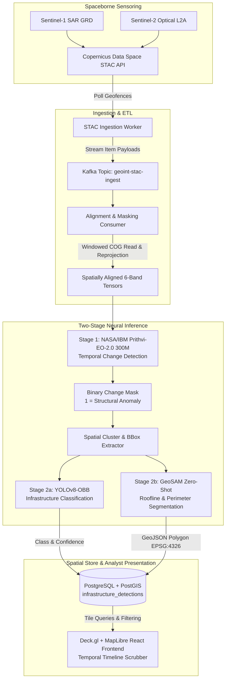

# Project Caelum-EO

[](LICENSE)
[](https://www.python.org/)
[](https://kafka.apache.org/)
[](https://postgis.net/)
[](https://deck.gl/)

> **Caelum** *(Latin: sky, the heavens)* — Continuous automated geospatial intelligence (GEOINT) pipeline for detecting, classifying, and mapping infrastructure build-out using Earth Observation AI foundation models.

Repository: **`github.com/FranekJemiolo/Caelum-EO`**

---

## 🛰️ Architecture Overview

Project Caelum-EO automates the end-to-end intelligence cycle from spaceborne sensor ingest to interactive visual analyst tooling:



---

## 🛠️ Tech Stack

*   **Message Broker & ETL:** Python 3.11, Apache Kafka, `pystac-client`, `rasterio`, `xarray`, `shapely`
*   **Machine Learning (Temporal Detection):** Hugging Face `ibm-nasa-geospatial/Prithvi-EO-2.0-300M` via PyTorch & MMSegmentation
*   **Machine Learning (Classification & Vectorization):** YOLOv8-OBB (Oriented Bounding Boxes), GeoSAM (Segment Anything for EO)
*   **Database:** PostgreSQL 16 with PostGIS extension (`GIST` indexed)
*   **Frontend / Visualization:** React, Deck.gl `GeoJsonLayer`, MapLibre GL
*   **Containerization:** Docker & Docker Compose

---

## 📁 Repository Structure

```
.
├── JOURNAL.md                      # Engineering journal & decision logs
├── README.md                       # Main project documentation
├── docker-compose.yml              # Multi-container orchestration (Kafka, PostGIS, Workers)
├── pyproject.toml                  # Python package configuration (3.11 target)
├── docs/                           # Architecture, specs & design documents
│   ├── architecture.md             # System design & data flow specification
│   ├── ingestion_pipeline.md       # STAC polling & Kafka messaging specification
│   └── data_dictionary.md          # Schema & tensor specifications
├── services/
│   ├── ingestion/                  # Component 1: STAC ETL & Kafka Ingestion Firehose
│   │   ├── Dockerfile
│   │   ├── requirements.txt
│   │   ├── config.py               # Pydantic configuration & geofence definitions
│   │   ├── cdse_stac_client.py     # Copernicus Data Space STAC API client
│   │   ├── kafka_producer.py       # Resilient Kafka producer with retry mechanics
│   │   ├── poll_worker.py          # CLI runner & recurring poller
│   │   └── tests/                  # Pytest suite with mock STAC responses
│   ├── inference/                  # Components 2 & 3: Prithvi & YOLO/GeoSAM
│   └── database/                   # Component 4: PostGIS migrations & spatial indexes
└── web/                            # Component 5: React Deck.gl temporal dashboard
```

---

## 🚀 Quickstart & Verification

### 1. Launch Core Infrastructure
```bash
docker compose up -d zookeeper kafka postgis
```

### 2. Configure Environment
```bash
cp .env.example .env
# Edit .env with Copernicus credentials or optional settings
```

### 3. Run Ingestion Tests
```bash
pytest services/ingestion/tests/ -v
```

### 4. Execute STAC Ingestion Poller
```bash
python -m services.ingestion.poll_worker --once
```

---

## 📜 License
Licensed under Apache 2.0. Maintained by [Franek Jemiolo](https://github.com/FranekJemiolo).
