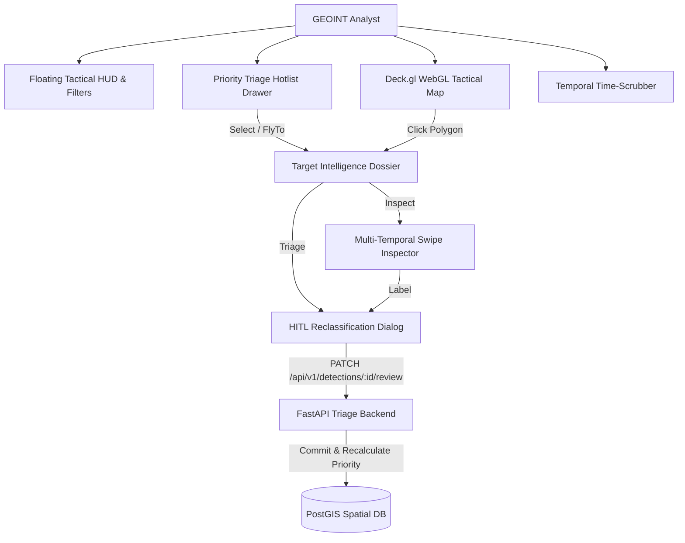

# Project Caelum-EO: Analyst UI & HITL Triage Specification

**Project:** Caelum-EO (`github.com/FranekJemiolo/Caelum-EO`)  
**Target:** Automated Geospatial Intelligence (GEOINT) Infrastructure Detection Platform

---

## 1. UI Architectural Overview

The Caelum-EO Analyst Interface is built with React 18, TypeScript, TailwindCSS, Deck.gl v9, and MapLibre GL. It is tailored for rapid geospatial intelligence analysis across large surveillance corridors (e.g. the Suwalki Strategic Gap).

---

## 2. Component Specifications

### 2.1 Dual Visualization Modes (`MapComponent.tsx`)
1. **Vector Bounding Box & Polygon Extraction Layer (`GeoJsonLayer`):**
   - High-contrast, extruded 3D polygon footprints based on model confidence elevation.
   - Exact tactical classification color codes:
     - **Cyan (`#00f2fe`)**: `RADAR_DOME`
     - **Amber (`#f59e0b`)**: `RUNWAY_TAXIWAY`
     - **Purple (`#a855f7`)**: `LOGISTICS_DEPOT`
     - **Pink (`#ec4899`)**: `DEFENSE_REVETMENT`
     - **Emerald (`#10b981`)**: `INDUSTRIAL_BUILDING`
     - **Crimson (`#f43f5e`)**: `UNKNOWN_STRUCTURE`
   - Interactive hover tooltip detailing classification, confidence percentage, acquisition timestamp, and geodesic surface area ($m^2$).
2. **Regional Density / Zone Hotspot Layer (`GeoJsonLayer`):**
   - Renders polygon boundaries of predefined strategic surveillance zones (`geographic_zones`).
   - Dynamic fill opacity and border stroke reflecting detection density and alert posture (`HIGH`, `ELEVATED`, `NORMAL`).

---

### 2.2 Priority Triage Drawer ("Hotlist") (`TriageHotlist.tsx`)
- Collapsible right drawer ranking detected anomalies by descending `priority_score`.
- Displays sensor pass timestamp, classification badge, and priority index ($P-0$ to $P-100$).
- Clicking an anomaly triggers smooth camera flight (`flyTo`) centering the map directly on the target coordinates.
- Review state indicator (`PENDING`, `VERIFIED`, `FALSE_POSITIVE`).

---

### 2.3 Multi-Temporal Image Inspector (`MultiTemporalInspector.tsx`)
- **Split-Screen Horizontal Swipe Comparison:**
  - $T_0$ Baseline satellite chip on the left.
  - $T_1$ Detection satellite chip on the right.
  - Interactive draggable vertical split divider allowing sub-pixel visual comparison.
- **AI Change Mask Toggle (`M` Key):**
  - Instant overlay toggle displaying the high-contrast binary difference mask over $T_1$.
- **Metadata Inspection Bar:**
  - Displays sensor platform (`Sentinel-2A` / `Sentinel-2B`), pass timestamps, sun azimuth, and cloud cover percentages.

---

### 2.4 Human-in-the-Loop (HITL) Review Modal (`ReviewModal.tsx`)
- Rapid triage action buttons:
  - `[V] Verify Correct`: Confirms predicted classification.
  - `[M] Reclassify`: Opens dropdown allowing manual correction to any valid `infrastructure_class`.
  - `[F] Mark False Positive`: Flags the anomaly as non-structural noise (e.g. agricultural tilling), dropping `priority_score` to $0.0$.
- Analyst notes textarea for logging analytical rationale into `review_audit_log`.
- **Keyboard Shortcuts:**
  - `V`: Verify
  - `F`: False Positive
  - `Space`: Next item in triage queue
  - `Esc`: Dismiss modal
