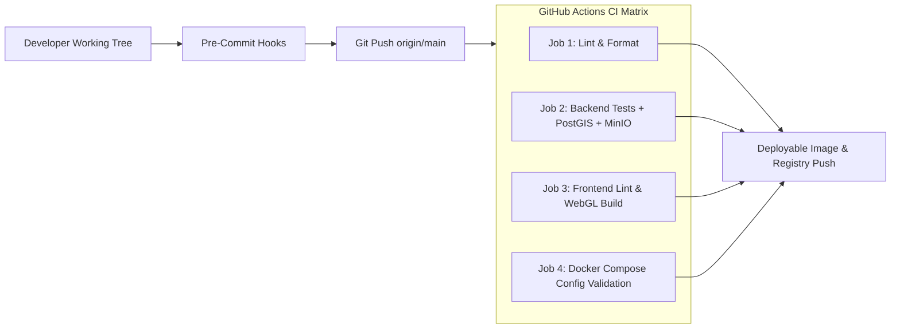

# CI/CD Pipeline & Quality Engineering Specification

**Project:** Caelum-EO (`github.com/FranekJemiolo/Caelum-EO`)
**Target:** Automated GEOINT Infrastructure Detection Pipeline

---

## 1. Quality Gates Architecture

Project Caelum-EO enforces a strict multi-tier quality gate architecture across both backend (Python 3.11, GDAL, PyTorch, PostGIS) and frontend (React 18, TypeScript, Deck.gl, TailwindCSS).



---

## 2. Pre-Commit Hooks Specification (`.pre-commit-config.yaml`)

All commits must pass automated local hooks before being pushed:

| Tool                 | Hook ID                   | Purpose                             | Configuration                      |
| -------------------- | ------------------------- | ----------------------------------- | ---------------------------------- |
| **pre-commit-hooks** | `trailing-whitespace`     | Strip trailing whitespace           | Standard                           |
| **pre-commit-hooks** | `end-of-file-fixer`       | Ensure newline at EOF               | Standard                           |
| **pre-commit-hooks** | `check-yaml`              | Validate YAML syntax                | Standard                           |
| **pre-commit-hooks** | `check-json`              | Validate JSON structure             | Standard                           |
| **pre-commit-hooks** | `check-added-large-files` | Prevent accidental binary leaks     | `--maxkb=10240` (10MB limit)       |
| **Ruff**             | `ruff`                    | Python linting (F, E, W, I, B)      | Auto-fix `--fix` enabled           |
| **Ruff**             | `ruff-format`             | Fast code formatting                | Black-compatible                   |
| **mypy**             | `mypy`                    | Static type checking                | Strict, `--ignore-missing-imports` |
| **Prettier**         | `prettier`                | Frontend formatting (JSON, CSS, TS) | Scoped to frontend and docs        |
| **ESLint**           | `frontend-eslint`         | Frontend static analysis            | Strict TypeScript linting          |

---

## 3. GitHub Actions CI Lifecycle (`.github/workflows/ci.yml`)

The CI workflow triggers on every `push` and `pull_request` targeting `main`:

### Job 1: `lint-and-format`

- **Runner:** `ubuntu-latest`
- **Dependencies:** Python 3.11, Node.js 20, cached pre-commit environments.
- **Execution:** Runs `pre-commit run --all-files` verifying complete code formatting, typing, and hygiene.

### Job 2: `backend-tests`

- **Service Containers:**
  - `postgis/postgis:15-3.3` on port `5432` with health checks.
  - `minio/minio:latest` on ports `9000`/`9001`.
- **Database Migration:** Executes `src/db/init.sql` ensuring PostGIS extensions, spatial GIST indexes, and review schemas are applied.
- **Test Suite:** Runs `pytest tests/` with code coverage tracking (`--cov=src --cov-fail-under=80`).

### Job 3: `frontend-quality`

- **Runner:** `ubuntu-latest`
- **Execution:** Runs `npm ci`, `npm run lint` (ESLint 9), and `npm run build` (Vite) ensuring zero TypeScript or bundler errors.

### Job 4: `docker-validation`

- **Runner:** `ubuntu-latest`
- **Execution:** Runs `docker compose config --quiet` verifying syntax, service references, environment interpolation, and network declarations.

---

## 4. Local Execution & Validation

Developers can run all quality checks locally:

```bash
# Run all pre-commit hooks
pre-commit run --all-files

# Run backend tests with coverage
pytest tests/ --cov=src --cov-report=term-missing

# Run frontend lint and build
cd src/frontend && npm run lint && npm run build
```
