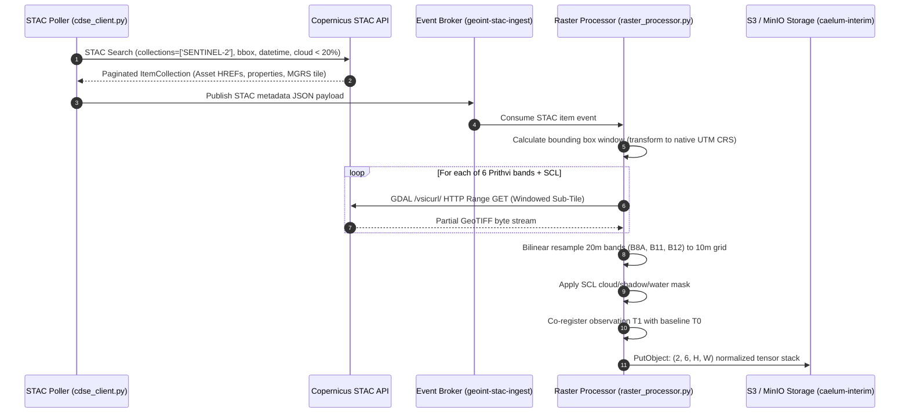

# Project Caelum-EO: ETL & Streaming Raster Pipeline Specification

**Repository Namespace:** `github.com/FranekJemiolo/Caelum-EO`  
**Components:** `src/etl/cdse_client.py`, `src/etl/raster_processor.py`

---

## 1. Overview & Operational Pipeline

Processing high-volume Earth Observation data requires strict decoupling of scene discovery from data acquisition. Project Caelum-EO ingests Copernicus Sentinel-2 (Level-2A BOA reflectance) and Sentinel-1 (GRD) streams using a windowed streaming architecture:



---

## 2. STAC Pagination & Query Protocol

### 2.1. Endpoints & Authentication
- **STAC Catalog:** `https://catalogue.dataspace.copernicus.eu/stac`
- **Identity Token Endpoint:** `https://identity.dataspace.copernicus.eu/auth/realms/CDSE/protocol/openid-connect/token`
- **S3 Direct Access:** `eodata.dataspace.copernicus.eu` with S3 keys generated in the CDSE dashboard.

### 2.2. Query Parameters
```python
search = client.search(
    collections=["SENTINEL-2"],
    bbox=[min_lon, min_lat, max_lon, max_lat],
    datetime=f"{start_utc}/{end_utc}",
    query={"eo:cloud_cover": {"lt": 20.0}},
    max_items=100
)
```
- **Pagination Strategy:** Uses STAC cursor-based pagination with `pystac-client`'s internal generator to step through item pages transparently without memory buildup.

---

## 3. Windowed Streaming Reads (Zero-Download Ingestion)

Downloading full 1GB Level-2A `.SAFE` zip archives exhausts disk space and network bandwidth. Caelum-EO implements GDAL virtual file system range streaming:
- **Protocol:** `rasterio` reads through `/vsicurl/` with HTTP byte-range headers (`Range: bytes=start-end`).
- **Window Formulation:**
  ```python
  from rasterio.windows import from_bounds
  with rasterio.open(f"/vsicurl/{cog_url}") as src:
      window = from_bounds(min_x, min_y, max_x, max_y, transform=src.transform)
      band_data = src.read(1, window=window, out_shape=(target_h, target_w))
  ```

---

## 4. Band Standardization & Spatial Resampling

Prithvi-EO-2.0 requires an exact 6-band input cube:

| Band Key | Spectral Description | Native Resolution | Target Resolution | Resampling Algorithm |
| :--- | :--- | :--- | :--- | :--- |
| `B02` | Blue (490 nm) | 10m | 10m | None (Native) |
| `B03` | Green (560 nm) | 10m | 10m | None (Native) |
| `B04` | Red (665 nm) | 10m | 10m | None (Native) |
| `B8A` | Narrow NIR (865 nm) | 20m | 10m | `Resampling.bilinear` |
| `B11` | SWIR 1 (1610 nm) | 20m | 10m | `Resampling.bilinear` |
| `B12` | SWIR 2 (2190 nm) | 20m | 10m | `Resampling.bilinear` |

---

## 5. Quality & Cloud Masking (Scene Classification Layer - SCL)

The Sentinel-2 L2A product provides an `SCL` 20m raster classifying every pixel:

| SCL Value | Description | Pipeline Action |
| :---: | :--- | :--- |
| `0` | No Data | Masked out (`0.0`) |
| `1` | Saturated / Defective | Masked out (`0.0`) |
| `3` | Cloud Shadows | **Masked out** (`0.0`) |
| `4` | Vegetation | Retained |
| `5` | Bare Soils | Retained |
| `6` | Water Bodies | **Masked out** (unless coastal pier detection is configured) |
| `7` | Low Probability Cloud | Retained |
| `8` | Medium Probability Cloud | **Masked out** (`0.0`) |
| `9` | High Probability Cloud | **Masked out** (`0.0`) |
| `10` | Thin Cirrus | **Masked out** (`0.0`) |
| `11` | Snow / Ice | Masked out (`0.0`) |

---

## 6. Multi-Temporal Co-Registration

To guarantee that pixel $(y, x)$ in $T_0$ maps to the identical physical geographic ground coordinate in $T_1$:
1. Both rasters are projected into the target Coordinate Reference System (WGS 84 / UTM).
2. `rasterio.warp.reproject` aligns $T_1$ to the affine transform grid of $T_0$.
3. The resulting stacked tensor has shape `(2, 6, H, W)` where axis 0 is the temporal step ($T_0, T_1$).
