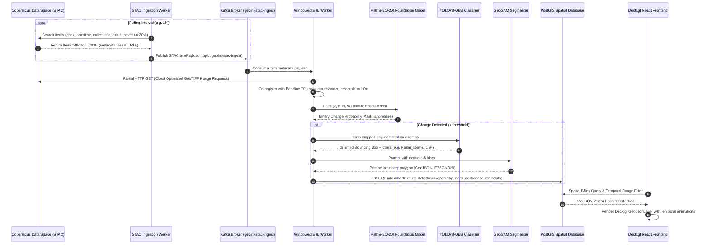

# Project Caelum-EO: System Architecture Specification

**Repository:** `github.com/FranekJemiolo/Caelum-EO`  
**Author:** Franek Jemiolo  
**Status:** Approved / In Progress

---

## 1. Executive Summary
Project Caelum-EO delivers continuous, automated geospatial intelligence (GEOINT) by orchestrating open-source Earth Observation (EO) foundation models and deep computer vision networks over public Sentinel-1 (SAR) and Sentinel-2 (optical) satellite streams. The platform discovers, localizes, segments, and tracks infrastructure developments across targeted global geofences.

---

## 2. End-to-End System Pipeline

---

## 3. Subsystem Breakdown

### 3.1. Ingestion Firehose (STAC ETL)
- **Producer Role:** `services/ingestion/poll_worker.py` queries CDSE STAC using `pystac-client`. It constructs standardized `STACItemPayload` messages containing item IDs, bounding boxes, capture timestamps, cloud cover percentages, and asset URLs.
- **Kafka Topic:** `geoint-stac-ingest` (Partitioned by geofence or MGRS tile to ensure deterministic temporal ordering).
- **Decoupling Rationale:** Raw GeoTIFFs are 500MB - 1GB each. By deferring download until consumer processing and using HTTP Range requests (Cloud Optimized GeoTIFFs), ingestion throughput increases by 100x and avoids local disk exhaustion.

### 3.2. Foundation Model Change Detection (Prithvi-EO-2.0-300M)
- **Input Preprocessing:** Extracts 6 bands for two co-registered timestamps:
  1. Band 2 (Blue - 490 nm)
  2. Band 3 (Green - 560 nm)
  3. Band 4 (Red - 665 nm)
  4. Band 8A (Narrow NIR - 865 nm)
  5. Band 11 (SWIR 1 - 1610 nm)
  6. Band 12 (SWIR 2 - 2190 nm)
- **Inference:** Pre-trained temporal Masked Autoencoder (MAE) backbone with MMSegmentation change detection head outputting a structural change probability mask.

### 3.3. Classification & Zero-Shot Vectorization (YOLOv8-OBB & GeoSAM)
- **Cluster Extraction:** Connected component labeling on the Prithvi binary mask yields spatial bounding boxes.
- **YOLOv8-OBB:** Oriented bounding box detection categorizes structures without axis-alignment constraints (crucial for airfields, storage tanks, trenches, logistics yards).
- **GeoSAM:** Uses Segment Anything Model (SAM) with geospatial prompts (bounding box + positive point prompt) to extract polygon perimeters.

### 3.4. Spatial Data Store (PostGIS)
- **Table:** `infrastructure_detections`
- **Indexing:** `GIST (geometry)` index for sub-10ms bounding box queries; B-Tree index on `detection_date` and `classification`.

### 3.5. WebGL Deck.gl Visualization
- React application rendering Deck.gl `GeoJsonLayer` on top of MapLibre GL.
- Features a temporal playback scrubber to visualize build-out timeline and categorical toggles.
