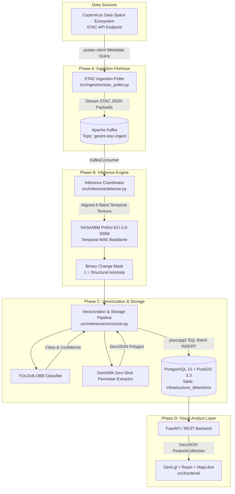

# Project Caelum-EO: System Architecture Specification (Phase 2 Deep Design)

**Repository Namespace:** `github.com/FranekJemiolo/Caelum-EO`  
**Role:** Principal Distributed Systems Engineer  
**Status:** Approved & Baseline Specification

---

## 1. System Mission & Data Flow

Project Caelum-EO delivers continuous, automated geospatial intelligence (GEOINT) by orchestrating open-source Earth Observation (EO) foundation models and deep computer vision networks over public Sentinel-1 (SAR) and Sentinel-2 (optical) satellite streams. The platform discovers, localizes, segments, and tracks infrastructure developments across targeted global geofences.

---

## 2. Distributed Architecture & Component Responsibilities

### 2.1. Ingestion Poller (`src/ingestion/stac_poller.py`)
- **Decoupled Firehose:** Queries the CDSE STAC endpoint (`https://catalogue.dataspace.copernicus.eu/stac`) using `pystac-client`.
- **Zero-Download Ingestion Policy:** Raw Copernicus GeoTIFF files are 500MB - 1GB each. The ingestion poller avoids downloading rasters into memory, extracting only the metadata, bounding boxes, cloud cover, and asset download URLs for the 6 core optical bands (`B02`, `B03`, `B04`, `B8A`, `B11`, `B12`).
- **Kafka Topic:** Emits strictly formatted JSON payloads into `geoint-stac-ingest`.

### 2.2. Inference Coordinator (`src/inference/detector.py`)
- **Event-Driven Consumption:** Listens to `geoint-stac-ingest` as part of consumer group `caelum-inference-workers`.
- **Temporal Alignment:** Coordinates pairs of scenes (Time $T_0$ baseline vs Time $T_1$ new acquisition).
- **Prithvi-EO-2.0 Foundation Model:** Feeds preprocessed $(2, 6, H, W)$ tensors into the masked autoencoder backbone to produce a structural change probability array.

### 2.3. Vectorization & PostGIS Persistence (`src/inference/vectorizer.py`)
- **Morphological Bounding Box Extraction:** Labels connected components of change pixels to derive spatial bounding chips.
- **Classification & Segmentation:** Dispatches chips to YOLOv8-OBB for tactical classification and GeoSAM for zero-shot boundary polygon extraction.
- **Database Engine:** Pushes vectorized features to PostgreSQL 15 / PostGIS 3.3 via parameterized `psycopg2` transactions with spatial geometry validation.

### 2.4. Deck.gl Presentation Tier (`src/frontend/`)
- High-performance WebGL vector layer (`GeoJsonLayer`) on top of a dark-mode MapLibre basemap.
- Real-time classification color encoding, confidence filtering, and temporal slider controls.
